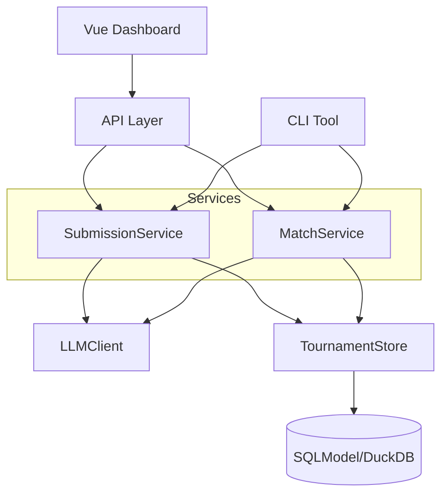

# LLM Tournament Evaluator

Compare OpenRouter models by having them write essays, critique each other, revise, and compete via pairwise tournament ranking with Elo or TrueSkill.

## Features

- **Multi-stage pipeline**: Generation → Critique → Revision → Ranking
- **High Performance**: Async core with parallel generation and judging
- **Pluggable Ranking**: Choose between **Elo** (classic) or **TrueSkill** (Bayesian, faster convergence)
- **Flexible Judging**: Audit mode (sequential) or parallel majority voting (3+2 judges)
- **Unified Persistence**: DuckDB-backed storage for scalable analytics
- **Dashboard Ready**: Native Parquet/JSON export for visualization
- **Full essay comparison**: No summaries or judge cards
- **Deterministic execution**: Seedable RNG, stable artifact naming
- **Cost control**: Token caps per role, dry-run mode, concurrency limits

## Installation

```bash
# Clone and install
git clone <repo-url>
cd llm-tournament
uv sync

# Install dev dependencies
uv sync --extra dev
```

## Quick Start

```bash
# Dry run (no API calls, uses fake LLM responses)
uv run llm-tournament run config.yaml --dry-run

# Real run with high concurrency
uv run llm-tournament run config.yaml --max-topics 1 --max-concurrency 10

# Use TrueSkill ranking algorithm
uv run llm-tournament run config.yaml --ranking trueskill

# Simple mode (rank only v0 essays, skip revision)
uv run llm-tournament run config.yaml --simple-mode

# Limit scope for testing
uv run llm-tournament run config.yaml --max-writers 3 --max-critics 3 --rounds 2
```

## Testing

```bash
uv run pytest
uv run pytest --cov=llm_tournament
```

## Dashboard

A Vue 3 + TypeScript dashboard is included for exploring results visually:

```bash
cd dashboard
npm install
npm run dev
```

Open http://localhost:5173, then drag and drop your run folder (or `tournament.duckdb` file) to explore:
- **Leaderboard**: Sortable table with Elo/TrueSkill rankings
- **Matches**: Browse judge decisions and reasoning
- **Essays**: Side-by-side essay comparison with markdown rendering


## Configuration

See `config.yaml` for a complete example. Key settings:

```yaml
writers:
  - openai/gpt-4-turbo
  - anthropic/claude-3-opus
  # ... at least 5 models

critics:
  - openai/gpt-4-turbo
  - anthropic/claude-3-sonnet
  # ... at least 5 models

judges:
  - openai/gpt-4-turbo
  - anthropic/claude-3-opus
  # ... at least 5 models

topics:
  - title: "Climate Change"
    prompts:
      Essay: "Write a comprehensive essay exploring..."
    source_pack: "Optional reference material..."

token_caps:
  writer_tokens: 1200
  critic_tokens: 200
  revision_tokens: 1300
  judge_tokens: 500

temperatures:
  writer: 0.7
  critic: 0.3
  judge: 0.2

ranking:
  algorithm: "elo" # or "trueskill"
  rounds: null     # Auto-calculated as ceil(log2(N)) + 1 if not set
  
  # Judging method: "audit" (sequential) or "parallel_majority" (3 judges)
  judging_method: "audit"
  audit_confidence_threshold: 0.7
  
  # For parallel_majority: configure judge pools
  primary_judges: null    # Defaults to judges list
  sub_judges: null        # Defaults to remaining judges
  primary_judge_count: 3  # How many primary judges
  sub_judge_count: 2      # How many sub-judges on low confidence
  
  # Elo settings
  initial_elo: 1500
  k_factor: 32
  
  # TrueSkill settings
  initial_mu: 25.0
  initial_sigma: 8.33

simple_mode: false
seed: 42
output_dir: "./runs"
```

## Output Structure

```
runs/{run_id}/
├── tournament.duckdb            # Full structured data (matches, ratings)
├── {topic_slug}/
│   ├── v0/                      # Initial essays
│   │   └── {writer_slug}.md
│   ├── feedback/                # Critic feedback
│   │   └── {writer_slug}__{critic_slug}.md
│   ├── v1/                      # Revised essays
│   │   └── {writer_slug}__{critic_slug}.md
│   ├── ranking/
│   │   ├── matches.jsonl        # Match log (backup)
│   │   ├── leaderboard.csv
│   │   ├── leaderboard.md
│   │   ├── leaderboard.json     # For dashboard
│   │   ├── writer_aggregate.md
│   │   ├── critic_metrics.md
│   │   └── analysis_{entity}.md # Strength/weakness analysis
├── config_snapshot.yaml
└── run_metadata.json
```

## System Architecture



For a detailed explanation of the architecture, see [docs/architecture.md](docs/architecture.md).

### Directory Structure

```text
src/llm_tournament/
├── api/                # FastAPI application
├── core/               # Configuration & Shared Utils
├── models/             # SQLModel Database Entities
├── services/           # Business Logic
│   ├── llm/            # LLM Client
│   ├── match/          # Pairing & Judging
│   └── submission/     # Generation & Revision
├── ranking/            # Elo/TrueSkill Algorithms
└── main.py             # Entry point
```

## License

MIT
