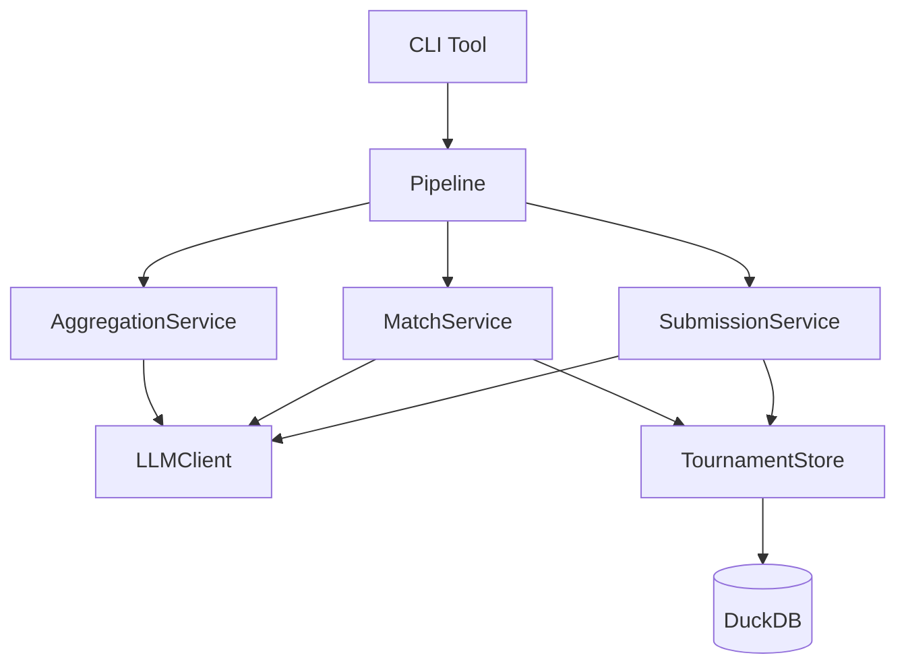

# LLM Tournament Evaluator

A flexible, auditable framework for identifying **the best LLM for your specific use case** by running head-to-head evaluations of OpenRouter-hosted models with efficient tournament-style ranking.

Built for real production systems where global benchmarks fail and decisions must be defensible, reproducible, and cost-aware.

---

## Why This Tool Exists

There is no single "best" LLM for text writing.

Public leaderboards (and personal experience) regularly disagree:

- [LLM Arena](https://llm-stats.com/arenas/llm-arena/chat-arena) (crowdsourced voting) shows the Gemini flash model leading, tailed by Opus and Deepseek
- [Chatbot Arena](https://lmarena.ai/leaderboard/text) ranks Gemini and Grok models at the top
- [Expert reviews](https://intellectualead.com/best-llm-writing/) favor different models for creative vs. technical writing
- [Eqbench creative writing longform](https://eqbench.com/creative_writing_longform.html) ranks Opus, sonnet, and Polaris Alpha models at the top
- [Eqbench creative writing](https://eqbench.com/creative_writing.html) favours Claude Opus, Kimi K2 and GPT5.2.


**Why the disagreement?** They measure **generic chat performance**, not how models behave in *your* domain, with *your* prompts, documents, constraints, and budget.

Whether you're building for a specific content niche or a RAG pipeline over domain documents, the same problem applies.

This becomes painfully obvious when building:

- Scientific or technical writing tools
- Marketing and copywriting assistants
- Legal, finance, or compliance workflows
- Creative writing or editorial systems
- RAG pipelines with domain-specific documents

A model that tops a leaderboard may:
- Produce unnatural prose in your specific style
- Handle technical terminology poorly
- Be brittle to your prompt structures
- Be too expensive at scale
- Be outdated (new models lag behind)

Static benchmarks won't tell you that. Only evaluation on *your* content will.

In addition, real-world writing pipelines often use an "editor agent" to provide feedback, and in [RAG-setting ensure the grounding of its answers](https://arxiv.org/html/2504.14858v3?ref=yonglun.me). A complete evaluation must also measure how well a model **responds to criticism and revises its work**, and how effective it is **as a critic** for other models.

---

## Why Manual A/B Testing Fails

The usual approach - manually testing a few prompts - doesn't scale.

It is:
- **Subjective**: different reviewers, different conclusions
- **Non-auditable**: hard to justify later
- **Non-reproducible**: results drift
- **Cost-inefficient**: explodes to O(n^2) comparisons

You end up with opinions, not evidence.

---

## The Solution: Tournament-Style Evaluation

Instead of asking *"Which model is best overall?"*, this framework asks:

> **Which model consistently wins head-to-head on *my tasks*, under *my constraints*?**

### How it works

Models compete in structured tournaments:

1. **Generation**: writers produce essays or responses
2. **Critique**: critics provide structured feedback
3. **Revision**: writers improve based on critiques
4. **Judging**: outputs are compared pairwise
5. **Ranking**: ratings update via Elo or TrueSkill

Rather than exhaustive round-robins, the system uses **Swiss-style pairing**, reducing comparisons from O(n^2) to O(n log n) while converging reliably on top performers.

### How Elo makes this efficient

Elo is a rating system designed for chess that finds the best players among millions without requiring everyone to play everyone else.

Each model has a numeric rating. When two compete, the winner gains points and the loser loses points. Crucially, the *amount* exchanged depends on the expected outcome - upsets cause large swings, expected wins cause small ones.

After just a few matches, ratings converge to reflect true skill. A world champion doesn't need to play millions of amateurs - a few games against other top players establishes their rating. Similarly, this tool identifies top LLMs in ~20-30 matches rather than hundreds.

### Why this beats static benchmarks

1. **Domain-specific by design**: Evaluate on your prompts, your documents, your scoring criteria - not someone else's benchmark.

2. **Fully auditable**: Every decision is backed by stored outputs, explicit comparisons, match logs, and rating trajectories. You can explain *why* a model won.

3. **Cost-efficient at scale**: Tournament pairing minimizes API calls and wasted comparisons.

4. **Robust to noise**: Rankings emerge from many structured comparisons. One lucky output doesn't dominate; one bad judge doesn't break results.

For a deeper dive, see [docs/why_tournaments.md](docs/why_tournaments.md).

---

## Features

- **Multi-stage pipeline**: Generation -> Critique -> Revision -> Ranking
- **Async and performant**: Parallel generation and judging
- **Pluggable ranking**: Elo (simple, interpretable) or TrueSkill (Bayesian)
- **Flexible judging**: Sequential audit mode or parallel majority voting
- **Cost control**: Token caps, dry-run mode, concurrency limits
- **Deterministic runs**: Seedable RNG, stable artifact naming
- **Unified persistence**: DuckDB-backed storage
- **Analytics-ready output**: Parquet/JSON exports
- **Full output comparison**: No summaries or judge cards

---

## Prerequisites

- Python 3.11+
- uv installed
- OpenRouter API key set as OPENROUTER_API_KEY (required for real runs; --dry-run does not require it)

## Installation

```bash
git clone https://github.com/adevol/LLMtournament.git
cd llmtournament
uv sync

# Dev dependencies
uv sync --extra dev
```

## Quick Start

```bash
# Dry run (no API calls, uses fake LLM responses)
uv run llm-tournament run config.yaml --dry-run

# Real run with high concurrency
uv run llm-tournament run config.yaml --max-topics 1 --max-concurrency 10

# Use TrueSkill ranking algorithm
uv run llm-tournament run config.yaml --ranking trueskill

# Simple mode (rank only v0 essays, skip revision)
uv run llm-tournament run config.yaml --simple-mode

# Limit scope for testing
uv run llm-tournament run config.yaml --max-writers 3 --max-critics 3 --rounds 2
```

## Testing

```bash
uv run pytest
uv run pytest --cov=llm_tournament
```

## Configuration

See [`config.yaml`](config.yaml) for a complete example. Key settings include:

- **writers/critics/judges**: Lists of OpenRouter model IDs to compare
- **topics**: Prompts and optional source material for essay generation
- **ranking**: Algorithm choice (Elo or TrueSkill), judging method, rounds
- **token_caps**: Per-role token limits for cost control
- **temperatures**: Sampling temperatures for each role

## Output Structure

```
runs/{run_id}/
├── tournament.duckdb            # Full structured data (matches, ratings)
├── {topic_slug}/
│   ├── v0/                      # Initial essays
│   │   └── {writer_slug}.md
│   ├── feedback/                # Critic feedback
│   │   └── {writer_slug}__{critic_slug}.md
│   ├── v1/                      # Revised essays
│   │   └── {writer_slug}__{critic_slug}.md
│   ├── ranking/
│   │   ├── matches.jsonl        # Match log (backup)
│   │   ├── leaderboard.csv
│   │   ├── leaderboard.md
│   │   ├── leaderboard.json     # Structured rankings
│   │   ├── writer_aggregate.md
│   │   ├── critic_metrics.md
│   │   └── analysis_{entity}.md # Strength/weakness analysis
├── config_snapshot.yaml
└── run_metadata.json
```

## System Architecture



For a detailed explanation, see [docs/architecture.md](docs/architecture.md).

### Directory Structure

```text
src/llm_tournament/
├── cli.py              # CLI entry point
├── pipeline.py         # Orchestration logic
├── core/               # Configuration & shared utilities
├── models/             # SQLModel database entities
├── prompts/            # Prompt templates
├── ranking/            # Elo/TrueSkill algorithms
└── services/           # Business logic
    ├── llm/            # LLM client (OpenRouter)
    ├── match/          # Pairing & judging
    ├── storage/        # DuckDB persistence
    ├── submission.py   # Essay generation & revision
    ├── analysis.py     # Per-model analysis
    └── aggregation.py  # Cross-model insights
```

## License

MIT

## Sources:
https://arxiv.org/html/2504.14858v3?ref=yonglun.me
