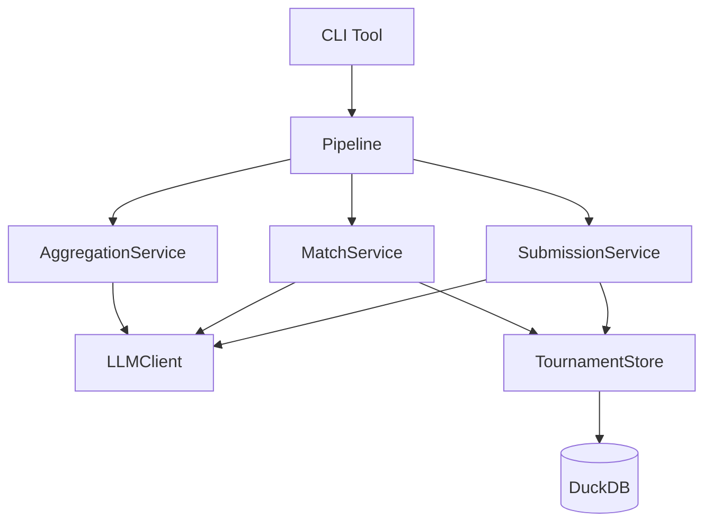

# LLM Tournament Evaluator

A flexible framework for finding the best LLM for *your* specific use case through head-to-head auditable scoring and efficient tournament-style ranking.

## Why This Tool Exists

Choosing the "best" LLM for writing is surprisingly hard. Public leaderboards disagree:

- [LLM Arena](https://llm-stats.com/arenas/llm-arena/chat-arena) (crowdsourced voting) shows Gemini 2.5 Flash leading
- [Chatbot Arena](https://lmarena.ai/leaderboard/text) ranks Claude and GPT models at the top
- [Expert reviews](https://intellectualead.com/best-llm-writing/) favor different models for creative vs. technical writing

**Why the disagreement?** Because there is no single "best" model. Performance depends heavily on your specific domain, writing style, and quality criteria. A model that excels at marketing copy may struggle with technical documentation. One that produces engaging fiction might generate unnatural-sounding business emails.

### The Real-World Problem

When building chatbots and writing assistants for clients across various domains, selecting the right model at the right cost is a critical decision. Manual A/B testing is time-consuming, subjective, and doesn't scale. You need:

1. **Auditable comparisons** - See exactly why one model beat another
2. **Domain-specific evaluation** - Test with *your* prompts and content types
3. **Cost efficiency** - Don't waste API credits on exhaustive round-robin comparisons

### The Solution: Tournament-Style Ranking

This tool automates model selection through **Swiss-system tournaments** with Elo or TrueSkill ratings. Instead of comparing every model against every other model (which scales O(n^2)), it uses smart pairing to find the best models in just O(n log n) comparisons.

## How Elo Rating Works

Elo is a rating system originally designed for chess that efficiently ranks players without requiring everyone to play everyone else. Here's how it finds the best among millions:

**The Core Idea**: Each player (or LLM) has a numeric rating. When two compete, the winner gains points and the loser loses points. Crucially, the *amount* exchanged depends on the expected outcome - upsets cause large swings, expected wins cause small ones.

**Why It's Efficient**: After just a few games, ratings converge to reflect true skill. A world champion doesn't need to play millions of amateurs - a few games against other top players establishes their rating. Similarly, this tool identifies top LLMs in ~20-30 matches rather than hundreds.

---

Compare OpenRouter models by having them write essays, critique each other, revise, and compete via pairwise tournament ranking with Elo or TrueSkill.

## Features

- **Multi-stage pipeline**: Generation → Critique → Revision → Ranking
- **High Performance**: Async core with parallel generation and judging
- **Pluggable Ranking**: Choose between **Elo** (classic) or **TrueSkill** (Bayesian, faster convergence)
- **Flexible Judging**: Audit mode (sequential) or parallel majority voting (3+2 judges)
- **Unified Persistence**: DuckDB-backed storage for scalable analytics
- **Dashboard Ready**: Native Parquet/JSON export for visualization
- **Full essay comparison**: No summaries or judge cards
- **Deterministic execution**: Seedable RNG, stable artifact naming
- **Cost control**: Token caps per role, dry-run mode, concurrency limits

## Installation

```bash
# Clone and install
git clone <repo-url>
cd llm-tournament
uv sync

# Install dev dependencies
uv sync --extra dev
```

## Quick Start

```bash
# Dry run (no API calls, uses fake LLM responses)
uv run llm-tournament run config.yaml --dry-run

# Real run with high concurrency
uv run llm-tournament run config.yaml --max-topics 1 --max-concurrency 10

# Use TrueSkill ranking algorithm
uv run llm-tournament run config.yaml --ranking trueskill

# Simple mode (rank only v0 essays, skip revision)
uv run llm-tournament run config.yaml --simple-mode

# Limit scope for testing
uv run llm-tournament run config.yaml --max-writers 3 --max-critics 3 --rounds 2
```

## Testing

```bash
uv run pytest
uv run pytest --cov=llm_tournament
```


## Configuration

See [`config.yaml`](config.yaml) for a complete example. Key settings include:

- **writers/critics/judges** - Lists of OpenRouter model IDs to compare
- **topics** - Prompts and optional source material for essay generation
- **ranking** - Algorithm choice (Elo or TrueSkill), judging method, rounds
- **token_caps** - Per-role token limits for cost control
- **temperatures** - Sampling temperatures for each role

## Output Structure

```
runs/{run_id}/
├── tournament.duckdb            # Full structured data (matches, ratings)
├── {topic_slug}/
│   ├── v0/                      # Initial essays
│   │   └── {writer_slug}.md
│   ├── feedback/                # Critic feedback
│   │   └── {writer_slug}__{critic_slug}.md
│   ├── v1/                      # Revised essays
│   │   └── {writer_slug}__{critic_slug}.md
│   ├── ranking/
│   │   ├── matches.jsonl        # Match log (backup)
│   │   ├── leaderboard.csv
│   │   ├── leaderboard.md
│   │   ├── leaderboard.json     # Structured rankings
│   │   ├── writer_aggregate.md
│   │   ├── critic_metrics.md
│   │   └── analysis_{entity}.md # Strength/weakness analysis
├── config_snapshot.yaml
└── run_metadata.json
```

## System Architecture



For a detailed explanation of the architecture, see [docs/architecture.md](docs/architecture.md).

### Directory Structure

```text
src/llm_tournament/
├── cli.py              # CLI entry point
├── pipeline.py         # Orchestration logic
├── core/               # Configuration & shared utilities
├── models/             # SQLModel database entities
├── prompts/            # Prompt templates
├── ranking/            # Elo/TrueSkill algorithms
└── services/           # Business logic
    ├── llm/            # LLM client (OpenRouter)
    ├── match/          # Pairing & judging
    ├── storage/        # DuckDB persistence
    ├── submission.py   # Essay generation & revision
    ├── analysis.py     # Per-model analysis
    └── aggregation.py  # Cross-model insights
```

## License

MIT
