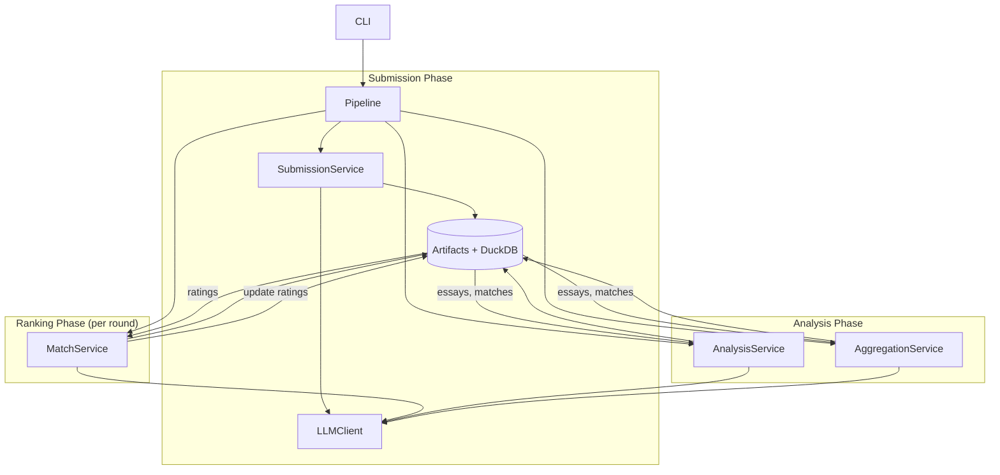

# System Architecture

## Objective

The LLM Tournament is a **deterministic, auditable evaluation system** for comparing LLMs on real-world writing tasks.  
It treats model evaluation as a *reproducible experiment*, not a leaderboard popularity contest.

Given a fixed configuration, prompts, and seed, a run produces:
- versioned written artifacts,
- head-to-head match results with judge reasoning,
- statistically grounded rankings,
- and structured outputs for analysis and visualization.

Everything is traceable. Nothing is hand-wavy.

---

## Design Principles

- **Determinism**: identical inputs should lead to identical outputs ([as much as possible](https://medium.com/@sulbha.jindal/why-llms-arent-truly-deterministic-7cc7b451fdab))
- **Auditability**: every decision traceable to prompts, models, and transcripts
- **Separation of concerns**: orchestration - domain logic - persistence
- **Pluggability**: ranking systems, LLM providers, prompts, storage
- **Modifiable**: easy to modify and extend for different models, questions, and metrics

---

## Run Lifecycle

A single tournament run proceeds through the following stages:

1. **Initialization**
   - Load `config.yaml` and `prompts.yaml`
   - Compute config + prompt hashes
   - Initialize RNG with deterministic seed
   - Open stores and caches

2. **Submission Phase**
   - Generate initial essays (Writer LLMs)
   - Persist artifacts and metadata

3. **Critique & Revision Phase (Optional)**
   - Critics evaluate submissions
   - Writers revise based on feedback
   - Multiple revision loops supported
   - All versions stored and addressable

4. **Match Phase (Swiss Rounds)**
   - Pair candidates using Swiss-style pairing (ratings-based)
   - Handle byes and rematches deterministically
   - Judge each match with Judge LLMs
   - Audit confidence and disagreement

5. **Rating Update**
   - Update ratings (Elo or TrueSkill)
   - Persist full rating history

6. **Aggregation & Analysis**
   - Build structured datasets (JSON)
   - Generate cross-model summaries
   - Produce strengths/weaknesses analysis

7. **Reporting**
   - Emit leaderboards, summaries, and manifests
   - Persist run metadata for replay

## Data Flow



## Core Components

### 1. CLI & Pipeline (`cli.py`, `pipeline.py`)
- **CLI**: Built with **Typer**, provides the `llm-tournament run` command.
- **Pipeline**: Orchestrates the full tournament flow across topics and rounds.
- Supports dry-run mode, configurable concurrency, and deterministic seeding.

### 2. Service Layer (`src/llm_tournament/services/`)
Encapsulates business logic into distinct domains:

- **`SubmissionService`**: 
  - Manages the creative lifecycle of essays.
  - Orchestrates **Generation** (Writer LLMs), **Critique** (Critic LLMs), and **Revision** (Writer LLMs).
  
- **`MatchService`**:
  - Manages the competitive aspect.
  - Implements **Swiss Pairing** logic to pair candidates.
  
    **Why Swiss?** In a round-robin tournament, N candidates require N(N-1)/2 matches - expensive at scale. Swiss pairing (used in chess tournaments) instead pairs candidates with *similar ratings* each round. After ~log2(N) rounds, the top performers emerge reliably without exhaustive comparisons.
    
    - **Pairing Logic**: Uses a robust pairing strategy:
        1.  **Strict Pass**: Attempts to find pairs who have *not* played each other yet.
        2.  **Fallback Pass**: If unpaired candidates remain, allows rematches to ensure participation.
        3.  **Bye Handling**: If an odd number of candidates exist, one is selected for a "Bye" (lowest rated with fewest byes) before pairing begins.
  - Orchestrates **Judging** (Judge LLMs) and **Auditing** (Confidence checks).
  - Updates rankings based on match results.

- **`AggregationService`**:
  - Generates cross-model insights and writer/critic summaries.
  - Produces structured JSON for visualization.

- **`AnalysisService`**:
  - Produces per-model strength/weakness analysis.

- **`LLMClient`**: 
  - Abstract interface for LLM providers (currently OpenRouter).
  - Handles caching (DuckDB), retries, and rate limiting.
  - Structured-output frameworks (e.g., PydanticAI) are not required; consider them only
    for judge JSON parsing and models with reliable schema support.

### 3. Data Layer (`src/llm_tournament/models/`, `src/llm_tournament/services/storage/`)
- **SQLModel** (SQLAlchemy + Pydantic) is used for all database entities.
- **Entities**:
  - `Match`: Stores detailed match results, including judge reasoning and transcripts.
  - `Rating`: Stores current ratings for each candidate/topic.
- **`TournamentStore`**: Unified repository pattern for database access, composed of:
  - `FileStore`: Handles essay/feedback file I/O
  - `DBStore`: Handles DuckDB persistence
  - `ReportStore`: Handles leaderboard and analysis outputs

### 4. Ranking (`src/llm_tournament/ranking/`)
- **Elo**: Classic chess-style rating system.
- **TrueSkill**: Bayesian rating with uncertainty modeling (via `openskill`).
- Pluggable via the `RankingSystem` protocol.

### 5. Prompts (`src/llm_tournament/prompts/`)
- Centralized prompt templates in `prompts.yaml`.
- Loaded at runtime for generation, critique, revision, and judging.
- Can be overridden per-tournament (`writer_system_prompt`, `judge_system_prompt`) or per-writer (`WriterConfig.system_prompt`).

## Directory Structure

```text
src/llm_tournament/
├── cli.py              # CLI entry point (Typer)
├── pipeline.py         # Tournament orchestration
├── core/               # Configuration & shared utilities
├── models/             # SQLModel database entities
├── prompts/            # Prompt loading utilities
├── prompts.yaml        # Centralized prompt templates
├── ranking/            # Elo/TrueSkill algorithms
└── services/           # Business logic
    ├── llm/            # LLM client (OpenRouter)
    ├── match/          # Pairing, judging, ranking logic
    ├── storage/        # File, DB, and report persistence
    ├── submission.py   # Generation, critique, revision
    ├── analysis.py     # Per-model analysis
    ├── aggregation.py  # Cross-model insights
    └── reporting.py    # Report generation
```

