# LLM Tournament Class Diagram

This document provides a comprehensive class diagram of all classes in the LLM Tournament codebase.

## Overview

The architecture consists of:
- **Configuration** classes for tournament setup
- **Models** (SQLModel) for database persistence
- **Ranking Systems** implementing different algorithms
- **Services** for LLM interaction, storage, and match orchestration
- **Pipeline** for orchestrating the tournament flow

## Class Diagram

```mermaid
classDiagram
    direction LR

    %% ==================== CONFIGURATION ====================
    namespace Configuration {
        class TournamentConfig {
            +writers: list~str | WriterConfig~
            +critics: list~str~
            +judges: list~str~
            +topics: list~TopicConfig~
            +writer_tokens: int
            +critic_tokens: int
            +revision_tokens: int
            +judge_tokens: int
            +writer_temp: float
            +critic_temp: float
            +revision_temp: float
            +judge_temp: float
            +analysis_top_k: int
            +ranking: RankingConfig
            +writer_system_prompt: str | None
            +judge_system_prompt: str | None
            +simple_mode: bool
            +seed: int
            +slug_max_length: int
            +output_dir: str
            +api_key: str | None
            +get_slug_model()
            +get_api_key()
            +get_writer_slug(writer)
            +get_writer_model_id(writer)
            +get_writer_system_prompt(writer)
        }

        class WriterConfig {
            +model_id: str
            +system_prompt: str | None
            +name: str | None
            +get_slug()
        }

        class TopicConfig {
            +title: str
            +prompts: dict~str, str~
            +source_pack: str | None
            +slug_max_length: int | None
            +slug: str
        }

        class RankingConfig {
            +algorithm: str
            +judging_method: str
            +rounds: int | None
            +audit_confidence_threshold: float
            +primary_judges: list~str~ | None
            +sub_judges: list~str~ | None
            +primary_judge_count: int
            +sub_judge_count: int
            +initial_elo: float
            +k_factor: float
            +initial_mu: float
            +initial_sigma: float | None
        }
    }

    TournamentConfig *-- TopicConfig
    TournamentConfig *-- RankingConfig
    TournamentConfig o-- WriterConfig

    %% ==================== MODELS (SQLModel) ====================
    namespace Models {
        class Match {
            +id: str
            +topic_slug: str
            +essay_a_id: str
            +essay_b_id: str
            +winner: str
            +confidence: float
            +reasons: list~str~
            +winner_edge: str
            +primary_judge: str
            +audit_judges: list~str~
            +final_decision: str
            +timestamp: datetime
        }

        class Rating {
            +id: str
            +topic_slug: str
            +candidate_id: str
            +rating: float
            +mu: float | None
            +sigma: float | None
            +matches: int
            +wins: int
            +losses: int
            +writer_slug: str
            +critic_slug: str | None
        }

        class LLMCall {
            +id: str
            +model: str
            +role: str
            +topic_slug: str | None
            +prompt_tokens: int
            +completion_tokens: int
            +total_tokens: int
            +cost_usd: float
            +timestamp: datetime
        }
    }

    %% ==================== RANKING ====================
    namespace Ranking {
        class RankingSystem {
            <<protocol>>
            +initialize(candidate_ids)
            +update(winner_id, loser_id, confidence)
            +get_rating(candidate_id)
            +get_stats(candidate_id)
            +get_leaderboard()
        }

        class EloSystem {
            +initial_rating: float
            +k_factor: float
            -_ratings: dict~str, EloRating~
            +initialize(candidate_ids)
            +update(winner_id, loser_id, confidence)
            +get_rating(candidate_id)
            +get_stats(candidate_id)
            +get_leaderboard()
        }

        class EloRating {
            +rating: float
            +matches: int
            +wins: int
            +losses: int
            +history: list~float~
            +record_match(new_rating, won)
        }

        class TrueSkillSystem {
            +initial_mu: float
            +initial_sigma: float
            -_ratings: dict~str, TrueSkillRating~
            -_ratings: dict~str, TrueSkillRating~
            -_model: PlackettLuce
            +initialize(candidate_ids)
            +update(winner_id, loser_id, confidence)
            +get_rating(candidate_id)
            +get_mu_sigma(candidate_id)
            +get_leaderboard()
        }

        class TrueSkillRating {
            +mu: float
            +sigma: float
            +matches: int
            +wins: int
            +losses: int
            +history: list~tuple~
            +ordinal: float
            +record_match(new_mu, new_sigma, won)
        }
    }

    RankingSystem <|.. EloSystem : implements
    RankingSystem <|.. TrueSkillSystem : implements
    EloSystem o-- EloRating
    TrueSkillSystem o-- TrueSkillRating

    %% ==================== LLM CLIENT ====================
    namespace LLMClient {
        class LLMResponse {
            <<dataclass>>
            +content: str
            +prompt_tokens: int
            +completion_tokens: int
            +total_tokens: int
        }

        class LLMClientABC {
            <<abstract>>
            +complete(model, messages, max_tokens, temperature)*
            +close()
        }

        class OpenRouterClient {
            +api_key: str
            +client: AsyncClient
            +complete(model, messages, max_tokens, temperature)
            +close()
        }

        class FakeLLMClient {
            +seed: int
            +call_count: int
            +complete(model, messages, max_tokens, temperature)
        }

        class PricingService {
            +api_key: str
            -_pricing: dict~str, ModelPricing~
            -_client: AsyncClient
            +refresh()
            +get_pricing(model_id)
            +compute_cost(model_id, prompt_tokens, completion_tokens)
            +list_models()
            +close()
        }

        class ModelPricing {
            <<dataclass>>
            +model_id: str
            +prompt_price: float
            +completion_price: float
            +context_length: int
            +compute_cost(prompt_tokens, completion_tokens)
        }

        class CostTracker {
            -_pricing: PricingService
            -_engine: Engine
            +record_call(model, response, role, topic_slug)
            +get_cost_breakdown()
            +get_model_costs()
            +get_total_cost()
            +get_topic_costs()
        }
    }

    LLMClientABC <|-- OpenRouterClient
    LLMClientABC <|-- FakeLLMClient
    OpenRouterClient o-- CostTracker
    PricingService o-- ModelPricing
    CostTracker --> PricingService
    CostTracker --> LLMCall

    %% ==================== STORAGE ====================
    namespace Storage {
        class TournamentStore {
            +config: TournamentConfig
            +run_id: str
            +base_dir: Path
            -_engine: Engine
            +topic_dir(topic_slug)
            +save_essay(topic_slug, writer_slug, content, version)
            +load_essay(topic_slug, essay_id, version)
            +save_feedback(topic_slug, writer_slug, critic_slug, content)
            +load_feedback(topic_slug, writer_slug, critic_slug)
            +save_revision(topic_slug, writer_slug, critic_slug, content)
            +save_match(topic_slug, match_data)
            +get_matches_for_essay(topic_slug, essay_id)
            +save_rating(topic_slug, rating_data)
            +get_leaderboard(topic_slug)
            +get_all_ratings()
            +save_report(topic_slug, filename, content)
            +save_ranking_output(topic_slug, leaderboard, ranking_system)
            +export_to_json(topic_slug, leaderboard)
            +save_aggregation_report(filename, content)
            +close_sync()
        }
    }

    TournamentStore --> Match
    TournamentStore --> Rating

    %% ==================== MATCH ENGINE ====================
    namespace MatchEngine {
        class JudgeResult {
            +winner: str
            +confidence: float
            +reasons: list~str~
            +winner_edge: str
        }

        class JudgeRotation {
            +judge_models: list~str~
            +current_index: int
            +next_judge()
            +get_audit_judges(exclude)
        }

        class MatchContext {
            <<dataclass>>
            +essay_a_id: str
            +essay_b_id: str
            +essay_a: str
            +essay_b: str
            +max_tokens: int
            +temperature: float
            +audit_threshold: float | None
            +custom_judge_system_prompt: str | None
        }

        class MatchResult {
            <<dataclass>>
            +essay_a_id: str
            +essay_b_id: str
            +winner: str
            +confidence: float
            +reasons: list~str~
            +winner_edge: str
            +primary_judge: str
            +audit_judges: list~str~
            +final_decision: str
            +timestamp: datetime
        }

        class Candidate {
            <<dataclass>>
            +id: str
            +rating: float
            +played_against: set~str~
            +writer_slug: str
            +critic_slug: str | None
            +byes: int
        }
    }

    %% ==================== SERVICES ====================
    namespace Services {
        class MatchService {
            +config: TournamentConfig
            +client: LLMClient
            +store: TournamentStore
            +run_ranking_round(topic_slug, round_num, candidates, ranking_system, rotation, version)
        }

        class SubmissionService {
            +config: TournamentConfig
            +client: LLMClient
            +store: TournamentStore
            -_semaphore: Semaphore
            +run_generation_batch(topic, writers)
            +run_critique_batch(topic, writers, critics)
            +run_revision_batch(topic, writers, critics)
        }

        class AnalysisService {
            +config: TournamentConfig
            +client: LLMClient
            +store: TournamentStore
            -_semaphore: Semaphore
            +run_analysis(topic_slug)
            +run_aggregation()
        }
    }

    %% MatchService --> LLMClientABC
    %% MatchService --> TournamentStore
    MatchService --> RankingSystem
    MatchService --> JudgeRotation
    MatchService --> Candidate
    %% SubmissionService --> LLMClientABC
    %%SubmissionService --> TournamentStore
    %% AnalysisService --> LLMClientABC
   %% AnalysisService --> TournamentStore

    %% ==================== PIPELINE ====================
    namespace Pipeline {
        class TournamentPipeline {
            +config: TournamentConfig
            +client: LLMClient
            +store: TournamentStore
            +max_concurrency: int
            +topics: list~TopicConfig~
            +writers: list~str~
            +critics: list~str~
            +judges: list~str~
            +submission_service: SubmissionService
            +match_service: MatchService
            +analysis_service: AnalysisService
            +run()
        }
    }

    TournamentPipeline --> TournamentConfig
    TournamentPipeline --> LLMClientABC
    TournamentPipeline --> TournamentStore
    TournamentPipeline *-- SubmissionService
    TournamentPipeline *-- MatchService
    TournamentPipeline *-- AnalysisService
```

## Module Organization

| Module | Classes |
|--------|---------|
| `core/config.py` | TournamentConfig, TopicConfig, RankingConfig, WriterConfig |
| `models/` | Match, Rating, LLMCall |
| `ranking/` | RankingSystem (protocol), EloSystem, EloRating, TrueSkillSystem, TrueSkillRating |
| `services/llm/` | LLMResponse, LLMClient, OpenRouterClient, FakeLLMClient, PricingService, ModelPricing, CostTracker |
| `services/storage/` | TournamentStore |
| `services/match/` | MatchService, JudgeRotation, JudgeResult, MatchContext, MatchResult, Candidate |
| `services/` | SubmissionService, AnalysisService |
| `pipeline.py` | TournamentPipeline |

## Recent Simplifications

- **Storage**: Merged `FileStore`, `DBStore`, `ReportStore` into single `TournamentStore`
- **Config**: Inlined `TokenCaps`, `Temperatures`, `AnalysisConfig` into `TournamentConfig`
- **Services**: Merged `AggregationService` into `AnalysisService`
