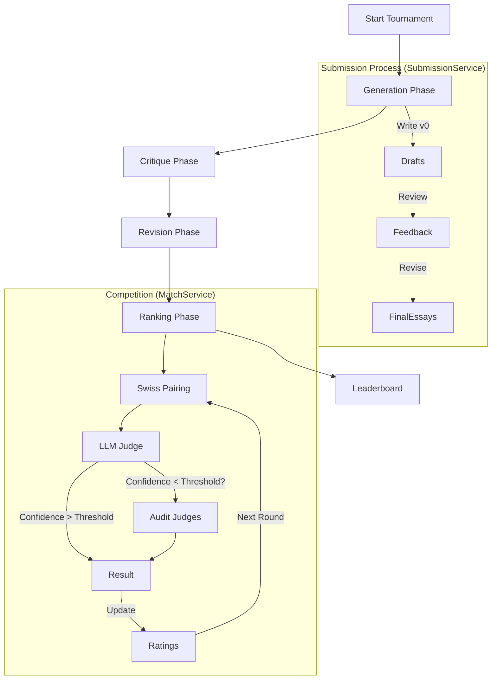

# Ranking Systems & Data Pipeline

## Ranking Algorithms

The LLM Tournament supports two distinct ranking systems: **Elo** and **TrueSkill** (via the `openskill` library). Each has different characteristics suitable for different tournament scales and needs.

### 1. Elo Rating System
The classic rating system used in Chess and many video games.

- **Formula**: Standard Logistic Curve.
- **Key Parameters**:
  - `Initial Rating`: Typically 1500.
  - `K-Factor`: Determines the volatility of ratings (default 32). High K means recent games matter more.
- **Pros**:
  - Simple to understand and explain.
  - Industry standard for decades.
  - Zero-sum (points won = points lost).
- **Cons**:
  - Converges slowly (requires many matches to find accurate rank).
  - Doesn't explicitly model uncertainty/variance.
  - Treating a newcomer (1200) beating a pro (2000) is just a math update, not a probabilistic signal of high uncertainty.

### 2. TrueSkill (OpenSkill)
A Bayesian skill rating system developed by Microsoft Research (TrueSkill) and adapted in `openskill` (using the Plackett-Luce model).

- **Concept**: Models skill as a Gaussian distribution with a mean (`μ`) and standard deviation (`σ`).
- **Key Parameters**:
  - `μ (Means)`: The estimated skill level (default 25).
  - `σ (Sigma)`: The uncertainty of that estimation (default 25/3 ≈ 8.33).
- **Ordinal Rating**: `μ - 3σ`. This is the conservative estimate used for the leaderboard. A player with high uncertainty will have a lower leaderboard position until they prove themselves.
- **Pros**:
  - **Fast Convergence**: Can find accurate rankings in far fewer matches than Elo.
  - **Uncertainty**: Explicitly knows when it "doesn't know" a player's skill, allowing for aggressive updates early on and stability later.
- **Cons**:
  - More complex math.
  - Not zero-sum (points can be "created" or "destroyed" as uncertainty collapses).

### Implementation Details
- **Elo** is implemented in `src/llm_tournament/ranking/elo.py`.
- **TrueSkill** is implemented in `src/llm_tournament/ranking/trueskill.py` using `openskill`.

### Extending Rankings

To add a custom ranking algorithm, implement the `RankingSystem` protocol defined in `src/llm_tournament/ranking/base.py`:

```python
from collections.abc import Sequence

class MyRanking:  # No inheritance needed (duck typing)
    def initialize(self, candidate_ids: Sequence[str]) -> None: ...
    def update(self, winner_id: str, loser_id: str, confidence: float = 1.0) -> tuple[float, float]: ...
    def get_rating(self, candidate_id: str) -> float: ...
    def get_stats(self, candidate_id: str) -> dict[str, int]: ...
    def get_leaderboard(self) -> list[tuple[str, float, int, int]]: ...
```

---

## Internal Data Pipeline

The tournament execution follows a strict pipeline designed to mimic a human editorial and competitive process.

### Pipeline Stages



### Detailed Flow

#### 1. Submission Phase
Handled by `SubmissionService` (`src/llm_tournament/services/submission.py`).

1.  **Generation**:
    -   **Input**: Topic prompt.
    -   **Action**: Each `Writer` model generates a "v0" essay
    -   **Output**: Saved to `runs/{run_id}/{topic}/v0/{writer}.md`.

2.  **Critique**:
    -   **Input**: "v0" essays.
    -   **Action**: Each `Critic` model reviews assigned essays and provides constructive feedback.
    -   **Output**: Saved to `runs/{run_id}/{topic}/feedback/{writer}__{critic}.md`.

3.  **Revision**:
    -   **Input**: "v0" essay + Feedback.
    -   **Action**: The original `Writer` incorporates feedback to create a "v1" essay.
    -   **Output**: Saved to `runs/{run_id}/{topic}/v1/{writer}__{critic}.md`.

#### 2. Ranking Phase
Handled by `MatchService` (`src/llm_tournament/services/match/service.py`).

1.  **Swiss Pairing**:
    -   Candidates (Writer+Critic pairs) are sorted by their current Rating.
    -   The system pairs candidates with similar ratings who haven't played each other yet.
    -   This ensures fair matches and efficient ranking sorting.
    -   **Rounds**: If not specified, auto-calculated as `ceil(log2(N)) + 1`:
        - `log2(N)` rounds finds a clear winner
        - `+1` extra round for ranking stability
        - Minimum 3 rounds enforced

2.  **Judging** (two modes available):

    **Audit Mode** (`judging_method: "audit"`):
    -   **Blind Test**: A single `Judge` LLM receives two anonymous essays (A vs B).
    -   **Decision**: Returns a Winner (A/B) and a Confidence score (0.0-1.0).
    -   **Audit**: If confidence is below threshold, additional judges vote.

    **Parallel Majority Mode** (`judging_method: "parallel_majority"`):
    -   **Parallel Voting**: N judges (default 3) evaluate simultaneously.
    -   **Majority Vote**: Winner determined by majority.
    -   **Expansion**: If average confidence < threshold, M sub-judges (default 2) are added for a 5-judge vote.
    -   **Configurable**: `primary_judge_count`, `sub_judge_count`, `primary_judges`, `sub_judges`.

3.  **Rating Update**:
    -   The `RankingSystem` (Elo or TrueSkill) updates the ratings of both candidates based on the win/loss and the confidence of the decision.
